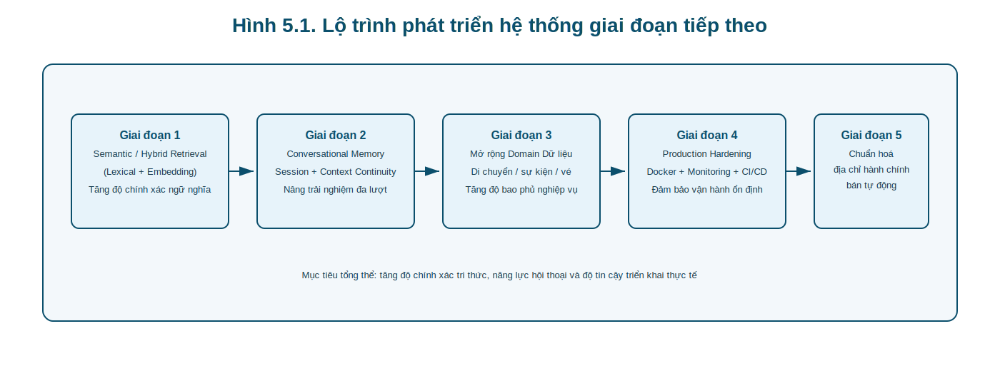

# CHƯƠNG 5: KẾT LUẬN VÀ HƯỚNG PHÁT TRIỂN

Chương này tổng hợp các kết quả chính của đề tài, đánh giá mức độ đáp ứng mục tiêu nghiên cứu đã đề ra, đồng thời xác định các hạn chế hiện hữu của hệ thống và đề xuất lộ trình phát triển trong giai đoạn tiếp theo. Nội dung được trình bày theo ba phần: (i) kết luận, (ii) hạn chế hiện tại, và (iii) hướng phát triển.

---

## 5.1 Kết luận

### 5.1.1 Tổng kết kết quả đạt được

Từ góc độ kỹ thuật, đề tài đã hoàn thành một hệ thống trợ lý du lịch theo kiến trúc Multi-Agent có khả năng vận hành end-to-end trong môi trường thực tế, bao gồm các thành phần chính:

* **Orchestrator Agent** chịu trách nhiệm phân loại intent và định tuyến bằng JSON có cấu trúc.
* **Response Agent** sinh phản hồi hội thoại cho các truy vấn thông tin thông thường.
* **Planning Agent** sinh lịch trình nhiều ngày dựa trên dữ liệu truy xuất.
* **Tool Layer** kết nối dữ liệu quan hệ và dịch vụ ngoại vi (thời tiết) để cung cấp ngữ cảnh có kiểm chứng.

Điểm mạnh cốt lõi của hệ thống nằm ở cách kết hợp giữa năng lực sinh ngôn ngữ của LLM và cơ chế truy xuất dữ liệu có kiểm soát. Thay vì để mô hình suy diễn tự do, hệ thống thực hiện chu trình “route → retrieve → inject → generate”, qua đó giảm đáng kể rủi ro hallucination trong miền dữ liệu địa phương [8], [22].

Bên cạnh đó, việc áp dụng Pydantic validation với ràng buộc exactly-one-intent tạo ra nền tảng định tuyến có tính xác định cao, giúp toàn bộ pipeline ổn định hơn trong thực thi thực tế [9], [10].

---

### 5.1.2 Mức độ đáp ứng mục tiêu nghiên cứu

Đối chiếu với mục tiêu đã nêu trong phần mở đầu, đề tài đạt được các kết quả chính sau:

1. **Đáp ứng mục tiêu về chức năng**: hệ thống xử lý được 8 intent đã thiết kế, bao phủ các bài toán cốt lõi của trợ lý du lịch địa phương.
2. **Đáp ứng mục tiêu về kiến trúc**: triển khai thành công mô hình Multi-Agent phân tầng, tách biệt rõ điều phối – truy xuất – sinh phản hồi.
3. **Đáp ứng mục tiêu về dữ liệu thực tế**: tích hợp cơ sở dữ liệu PostgreSQL với các bảng chuyên miền (ẩm thực, nhà hàng, địa điểm, khách sạn, dịch vụ) và luồng cập nhật dữ liệu từ nguồn thực địa.
4. **Đáp ứng mục tiêu về vận hành**: hệ thống có backend FastAPI, frontend Streamlit và cơ chế xử lý lỗi cơ bản, đủ để triển khai thử nghiệm người dùng.

Tổng thể, hệ thống đạt mức “proof-of-practice”: không chỉ dừng ở mô hình lý thuyết mà đã có khả năng ứng dụng trong ngữ cảnh địa phương cụ thể.

---

## 5.2 Hạn chế hiện tại

Mặc dù đạt được các kết quả khả quan, hệ thống vẫn tồn tại một số giới hạn cần được ghi nhận minh bạch.

### 5.2.1 Giới hạn của phương pháp truy xuất lexical

Cơ chế similarity hiện tại dựa trên `difflib.SequenceMatcher` cho ưu điểm nhẹ, dễ triển khai và dễ kiểm chứng, nhưng bản chất vẫn là so khớp bề mặt chuỗi (lexical matching). Do đó, hệ thống có thể bỏ sót các truy vấn đồng nghĩa/diễn đạt khác nghĩa bề mặt nhưng gần nghĩa ngữ nghĩa.

### 5.2.2 Thiếu bộ nhớ hội thoại đa lượt

Các agent hiện hoạt động theo mô hình stateless theo lượt, chưa có lớp quản lý memory dài hạn. Điều này làm giảm khả năng duy trì ngữ cảnh xuyên suốt khi người dùng hỏi chuỗi truy vấn liên tiếp.

### 5.2.3 Cơ chế tự sửa lỗi còn ngắn

Orchestrator có retry loop nhưng `max_retries` còn thấp, nên trong một số trường hợp JSON đầu ra lỗi liên tiếp, khả năng tự phục hồi chưa đủ mạnh.

### 5.2.4 Hạ tầng vận hành chưa tối ưu production

Hệ thống hiện ở mức triển khai thực nghiệm: chưa có đầy đủ connection pooling nâng cao, giám sát tập trung, và pipeline CI/CD cho vòng đời vận hành dài hạn [11], [12].

### 5.2.5 Thách thức dữ liệu hành chính giai đoạn chuyển tiếp

Sau thay đổi đơn vị hành chính 2025, dữ liệu công khai giữa các nền tảng còn chưa đồng bộ, khiến quá trình chuẩn hóa địa chỉ cần thao tác bán thủ công ở một số trường hợp [29], [30], [31], [32]. Đây là một hạn chế thực tế khi triển khai AI theo miền dữ liệu địa phương.

---

## 5.3 Hướng phát triển

Các định hướng dưới đây tập trung vào việc nâng cấp độ chính xác ngữ nghĩa, tăng tính ổn định vận hành và mở rộng phạm vi ứng dụng.

### 5.3.1 Nâng cấp semantic retrieval / RAG

Trong giai đoạn tiếp theo, hệ thống nên bổ sung lớp semantic retrieval (embedding-based search) bên cạnh lexical retrieval hiện tại để cải thiện khả năng hiểu truy vấn diễn đạt đa dạng. Cách tiếp cận hybrid retrieval giúp cân bằng giữa độ chính xác ngữ nghĩa và tính kiểm chứng của dữ liệu truy xuất [8], [20].

### 5.3.2 Bổ sung conversational memory

Cần xây dựng lớp quản lý hội thoại nhiều lượt (session memory), cho phép hệ thống ghi nhớ ràng buộc đã nêu trước đó (ngân sách, khẩu vị, khu vực ưu tiên), từ đó cải thiện tính liên tục trong trải nghiệm người dùng.

### 5.3.3 Mở rộng domain dữ liệu du lịch

Ngoài 5 bảng dữ liệu hiện có, hệ thống có thể mở rộng sang các miền:

* phương tiện di chuyển,
* sự kiện/lễ hội theo mùa,
* thông tin vé và khung giờ tham quan,
* dữ liệu đánh giá cộng đồng có kiểm chứng.

Mở rộng domain sẽ tăng độ bao phủ thông tin nhưng cần đi kèm cơ chế kiểm chuẩn dữ liệu đầu vào và quy trình quản trị dữ liệu chặt chẽ.

### 5.3.4 Production hóa hạ tầng triển khai

Định hướng production gồm:

* đóng gói dịch vụ bằng Docker,
* triển khai đa môi trường (dev/staging/prod),
* bổ sung logging/monitoring/alerting,
* thiết lập quy trình backup và phục hồi dữ liệu.

Mục tiêu là nâng hệ thống từ mức thử nghiệm học thuật lên nền tảng có thể vận hành ổn định dài hạn.

### 5.3.5 Chuẩn hoá địa chỉ hành chính bán tự động

Để xử lý biến động địa giới hành chính, cần xây dựng pipeline bán tự động cho:

1. nhận diện địa chỉ cũ,
2. đối chiếu danh mục hành chính mới,
3. ghi nhận địa chỉ chuẩn hoá kèm nguồn và thời gian cập nhật,
4. đồng bộ vào cơ sở dữ liệu nghiệp vụ.

Hướng này giúp giảm chi phí vận hành thủ công và tăng tính nhất quán dữ liệu khi chính sách hành chính tiếp tục thay đổi.

---

## 5.4 Tóm tắt chương

Chương 5 đã khẳng định rằng hệ thống đề xuất đạt được mục tiêu cốt lõi về mặt kiến trúc và chức năng cho bài toán trợ lý du lịch địa phương dựa trên Multi-Agent và LLM. Đồng thời, chương cũng chỉ ra rõ các giới hạn hiện tại về truy xuất ngữ nghĩa, bộ nhớ hội thoại, khả năng tự sửa lỗi và vận hành production.

Lộ trình phát triển được đề xuất theo hướng nâng cấp đồng thời ba trục: **(i) chất lượng tri thức truy xuất**, **(ii) năng lực hội thoại đa lượt**, và **(iii) độ tin cậy hạ tầng triển khai**. Đây là cơ sở để hệ thống tiến tới mức ứng dụng thực tiễn rộng hơn trong bối cảnh chuyển đổi số du lịch địa phương.

---

> Nguồn tham khảo của chương này được quản lý tập trung tại file `docs/REFERENCES`.
